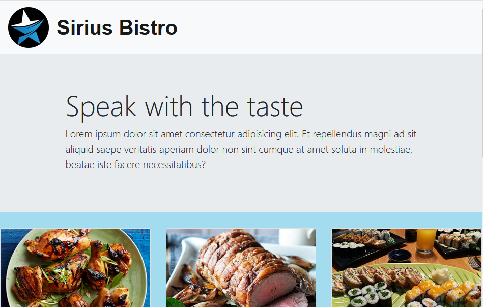

# Responsible Design with Bootstrap

Coursera course: [HTML, CSS, and Javascript for Web Developers](https://www.coursera.org/learn/html-css-javascript-for-web-developers)

My Account of Linked :  [Talk to me](https://www.linkedin.com/in/sirius-star/)

Woo-hoo! MORE CODING!!! Exciting! :-)

This working inculedes that :
* Card-Grid in BootStrap
* Navbar responsive design compatible with 3 mockup(desktop,tablet,mobil devices)
* Used media query
* Jumbotron and footer compenent in BootStrap

1. Since we are using Bootstrap for this assignment, instead of specifying pixel ranges, I will define our desktop, tablet, and mobile views in terms of Bootstrap CSS class prefixes, i.e., `md`, `sm`, and `xs`.
  * Desktop mockup illustration should correspond to Bootstrap `md`-based classes
  * Tablet mockup illustration should correspond to Bootstrap `sm`-based classes
  * Mobile mockup illustration should correspond to Bootstrap `xs`-based classes

2. Navbar: Create a navbar that scrolls away together with the page (the navbar should become invisible and is not fixed to the top when you scroll the page down). The navbar should have a company name (i.e., `navbar-brand` class) called "Food, LLC" that is aligned to the left side of the navbar. (*See* [https://getbootstrap.com/docs/3.3/components/#navbar](https://getbootstrap.com/docs/3.3/components/#navbar). *Make the browser window narrower to see the mobile menu button appear in the first example shown at the provided link.*)
  
For desktop and tablet view, the navbar should not contain anything else. No other buttons should be visible. (_Hint: use 'visible-xs' class._)

3. Navbar - Mobile View: Create a simple menu button (3 horizontal bars). When the user clicks that button, a dropdown menu should appear (as illustrated in Mobile Open Menu illustration below.) The dropdown menu should contain 3 items: Chicken, Beef, and Sushi.
  
The dropdown menu should take up the entire width of the browser window. Make sure the dropdown menu has a background color set that distinguishes it from the rest of the content.
  
(_Hint: See_ [_https://getbootstrap.com/docs/3.3/components/#navbar_](https://getbootstrap.com/docs/3.3/components/#navbar) _and Lecture 31 for examples on how to accomplish this._)

4.  Page Heading. The page heading that says Our Menu should be centered within the browser window. You must use a Bootstrap class to accomplish this.
  
(_Hint: look for a Bootstrap class that centers text, see_ [_https://getbootstrap.com/docs/3.3/css/#type-alignment_](https://getbootstrap.com/docs/3.3/css/#type-alignment)_._)

5.  Create a single really tall section that will use the Bootstrap Grid and take up the entire width of the browser window (minus some margins, of course) for all views: desktop, tablet, and mobile. To make the section really tall, you can either fill it out with a LOT of text or simply set its height to something like 1000px. It needs to be tall enough to cause scrolling down to be required to view the bottom of the section. Make sure its background color is set to distinguish it from the rest of the content. (_Hint: don't forget to have an element with a class='container' or class='container-fluid' wrapping your grid. Remember that to have the grid do something "always", i.e., no matter what browser window size, use the `col-xs-`... classes. In this case, since we want the section to take up the entire row, use `col-xs-12`._)

Here is the mockup illustration of the desktop & tablet version of the site :

 

Here is the mockup illustration of the mobile view (only required graded parts are shown):

