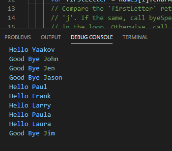

# Module 4 Coding Assignment

Coursera course: [HTML, CSS, and Javascript for Web Developers](https://www.coursera.org/learn/html-css-javascript-for-web-developers)

 **Purpose of this assigment**  In this assignment, you are going to loop over an array of names and print out either a `hello` or `goodbye` to that name to the browser console. If the name starts with a letter `j` or `J`, you are to print out `Goodbye JSomeName`. If the name starts with any other letter, you are to print out `Hello SomeName`.

**This assigment includes** that ;
 * Javascript code that Immediately Invoken Function Expression (IIFE)
 * Created Object
 * For Loop
 * String Method

